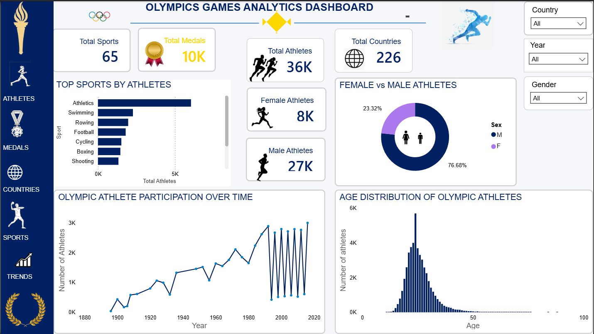
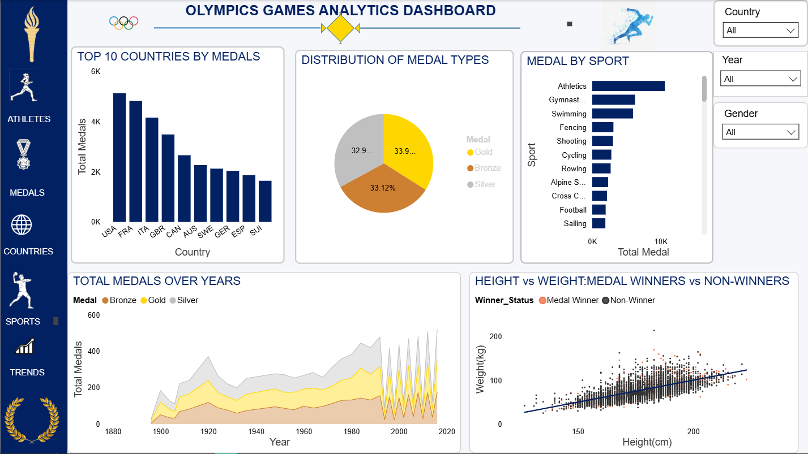

# Olympics Games Analytics Dashboard | Power BI

##  Project Overview

This project presents an interactive Power BI dashboard developed to analyze Olympic Games data.

The dashboard provides insights into athlete participation, medal distribution, sports performance, countries, athlete demographics, and trends across Olympic years.

The project transforms Olympic Games data into interactive visualizations that make it easier to explore participation and medal patterns.

---

##  Project Objectives

The main objectives of this project were to:

- Analyze Olympic athlete participation
- Examine medal distribution across countries and sports
- Identify countries with the highest number of medals
- Analyze athlete participation trends over time
- Compare male and female athlete participation
- Explore the age distribution of Olympic athletes
- Analyze the relationship between athlete height and weight
- Identify sports with high athlete participation
- Examine medal trends across Olympic years
- Provide an interactive dashboard for exploring Olympic data

---

##  Tools & Technologies

- **Power Query**
- **DAX**

---

#  Athlete Analysis

The Athlete Analysis dashboard provides an overview of Olympic participation and athlete demographics.

### Key Metrics

- **65** sports
- **10K** total medals
- **36K** athletes
- **226** countries
- **8K** female athletes
- **27K** male athletes

### Analysis Includes

- Top sports by number of athletes
- Female vs male athlete participation
- Olympic athlete participation over time
- Age distribution of Olympic athletes
- Total athletes by Olympic year
- Interactive filtering by country, year, and gender

### Dashboard Preview

---

#  Medal Analysis

The Medal Analysis dashboard focuses on medal distribution across countries, sports, medal types, and Olympic years.

### Analysis Includes

- Top 10 countries by medals
- Distribution of Gold, Silver, and Bronze medals
- Medal distribution by sport
- Total medals across Olympic years
- Height and weight comparison between medal winners and non-winners
- Interactive filtering by country, year, and gender

### Dashboard Preview

---

#  Key Insights

The dashboard provides several insights into Olympic participation and medal distribution.

### Athlete Participation

Athletics has the highest number of participating athletes among the sports displayed in the Athlete Analysis dashboard.

### Gender Distribution

The dashboard shows that male athletes represent the larger proportion of the athlete population, while female athletes account for approximately 23.32%.

### Countries and Medals

The Medal Analysis dashboard shows differences in medal totals across countries, with the United States having the highest medal count among the top countries displayed.

### Medal Distribution

Gold, silver, and bronze medals make up relatively similar portions of the overall medal distribution, with gold medals accounting for approximately 33.9% in the displayed dashboard.

### Athlete Participation Over Time

The number of participating athletes varies across Olympic years, with participation generally increasing over much of the period represented in the dataset.

### Athlete Demographics

The age distribution shows that Olympic participation is concentrated among athletes in their late teens through their twenties, with fewer athletes represented at older ages.

### Height and Weight

The height-versus-weight visualization shows a positive relationship between athlete height and weight, while also allowing comparison between medal winners and non-winners.

---

#  Dashboard Features

The dashboard includes interactive filters that allow users to explore the data by:

- Country
- Olympic Year
- Gender

These filters allow users to investigate different segments of Olympic participation and medal performance.

---

